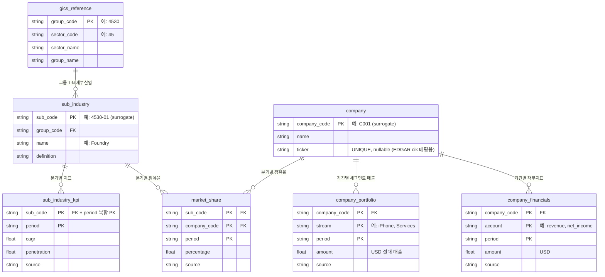

# value-agent 설계

개별 기업의 **미시적** 가치·잠재성·투자가능성을 분석하는 멀티에이전트 프로그램.
거시(시장·지표) 분석을 담당하는 별도 `stock-agent`와 짝을 이룬다.

## 분석 방향 — 탑다운 + 바텀업
- **탑다운**: 시장 전체 섹터를 훑어 유망 섹터와 경쟁 기업을 발굴
  - 섹터별 성장성·잠재성 분석 → 섹터 내 경쟁력 있는 기업 발굴
  - (거시 "시장 방향성"은 `stock-agent` 몫 → value-agent는 패스. 나중에 연동할 수 있게 입력 자리만 열어둠)
- **바텀업**: 발굴/관심 기업을 깊이 분석 (지표·경쟁력 등)
- 목적에 *"관심 기업보다 더 나은 후보 발굴"*도 포함

## 기술 스택
- **PydanticAI** — agent harness
- 데이터 도구는 **MCP**로 (`stock-agent`와 공유 가능하게 독립 위치 / 별도 레포)
- inter-agent orchestration, cloud at-scale 운영 + load test 목표

## 에이전트 구성

```
                    가드레일 (주제 게이트)
                           │
 [탑다운]                  ▼              [바텀업]
 섹터 분석 agent ──▶  사회자 orchestrator  ◀──▶  전문 분석 agent들
 (섹터→경쟁기업)      (흐름만 조율)   멀티턴   (지표·침투율·점유율·CAGR)
                           │ 라운드 반복
                           ▼
         종합분석 agent ──▶ 리포팅 agent (+차트 tool) ──▶ 📊 보고서
```

| 요소 | 역할 | 형태 |
|------|------|------|
| 사회자 (orchestrator) | 흐름 조율·라운드 진행/종료. 분석은 안 함 | agent |
| **섹터 분석 agent** | 미국 증시 전체 섹터(GICS 11개)의 성장성·잠재성 분석 → 경쟁 기업 발굴 | agent (+웹검색 tool) |
| 전문 분석 agent들 | 기업지표·침투율·점유율·CAGR 각자 조사 | agent (+도구·MCP) |
| 종합분석 agent | 받은 분석들 교차·종합 | agent |
| 리포팅 agent | 보고서 구조화·서술·시각화 | agent + 차트 tool |
| 가드레일 | 주제 적합성 검사 | LLM 게이트 (단발) |

## 데이터 소스
- **섹터 시장규모·CAGR·성장 전망**: 깔끔한 무료 API 없음(Statista €199/월~, IBISWorld $800+/건 등 유료) → **agent가 웹 검색으로 공개 헤드라인 수치를 조사** (웹검색 tool: **Serper** — 저렴 $0.3~1/1k, raw Google SERP). 정형 데이터 보조: Helgi Library(30개 섹터 무료), Data.gov.
- **개별 기업 재무·세그먼트(미국 상장사)**: **SEC EDGAR** — 무료·공식·게이트 없음. **edgartools** 라이브러리로 회사 총계 재무(매출·영업이익·순이익·현금흐름)와 제품/세그먼트별 매출을 XBRL 1차 소스에서 결정적으로 추출(ticker→cik 변환·XBRL 파싱·포맷 드리프트는 라이브러리가 처리 → regex·LLM 없음). 외국·비상장은 `company_agent` 웹검색 fallback. (기타 무료 재무 API: Finnhub, FMP, Alpha Vantage)
- 섹터 평가 지표: CAGR, 시장규모 성장률 + **agent 자율 판단으로 추가 지표 조사**.

## 핵심 설계 원칙
1. **사회자 ≠ 분석가** — 멀티턴 라운드로 각 agent가 서로 듣고 재분석 → `stock-agent`의 1-pass 단방향과 차별.
2. **연결은 중앙집중(O(n))** — agent 직접 연결은 "정말 도움 되는 짝"만 예외.
3. **agent는 자율 판단·도구가 필요할 때만** — 단발 작업은 tool / LLM 게이트. (LLM 호출 ≠ agent)
4. 데이터 도구(MCP)는 공유 가능하게 프로젝트 밖 독립 위치, agent 로직은 프로젝트 안.

## 구현 흐름 v1 — 프로그래밍 오케스트레이션 + 점진적 채우기

초기 "사회자 멀티턴" 대신, 결정적 코드 오케스트레이션으로 단순화 (LLM hand-off 아님).

```
1단계  POST /analyze {sector}   ── 큰 틀만, 얕고 빠르게
  sector_agent      → 시장조사 리포트(IDC·Gartner·Statista)에서
                       섹터 CAGR·규모 + 주요 세부산업(성장 견인) + (있으면) 시장규모
    └─ industry_agent ×N (병렬) → 각 세부산업의 회사 점유율 (Synergy·IDC 등)
  ※ company는 1단계에서 안 돌림. 빈 점유율은 그대로 둔다.

2단계  POST /refine ...          ── 사용자가 지목한 곳만 깊게
  refine_sub_industry(name) → 빈 세부산업 점유율 채움 (industry_agent 1개)
  refine_company(name)      → 그 회사 재무+포트폴리오 (미국 상장사=EDGAR 결정적, 그 외=company_agent 웹)
```

### 점진적 채우기(progressive refinement) 원칙
- **한 번에 완벽한 답은 불가능**을 전제. 1단계는 "큰 방향"만, **빈 곳은 그대로 둔다**.
- 사용자가 관심 있는 곳만 2단계(interaction)로 채운다 (human-in-the-loop).
- 효과: ① LLM이 "다 채워와"로 **검색 폭주**하는 걸 차단 ② 사용자 관심부에만 비용.
- 특히 **company는 1단계 제외** → 회사 클릭 시 on-demand 1건만 (10개 동시 폭주 방지).

### 검색 가드레일 (실측 교훈)
- 각 agent run에 PydanticAI 기본 **request_limit=50** 유지 (폭주 차단). 줄이면 정상 작업도 막힘.
- agent prompt: **권위 출처(시장조사 기관) 우선**, 못 찾으면 **빈값**(가짜보다 빈 게 낫다), **ETF factsheet 금지**(펀드 구성 ≠ 시장 규모).
- usage는 agent별 독립(공유 X — 공유하면 누적이 한도에 걸린다).

## 데이터 모델 (DB 스키마)

저장소는 **SQLite**(도커 내 파일, 별도 서버 없음 — Repository 포트로 추상화). GICS를 **`industry_group`(4자리, 25개)까지만** 고정 차용하고, 그 **아래 분석 단위(`sub_industry`)는 agent가 동적으로 식별**한다. GICS의 sub-industry(8자리, 163개)는 입도가 너무 거칠어 버린다 — 예: 반도체 전체가 `45301020` 한 칸이라 파운드리·메모리·팹리스·장비를 구분 못 함.

### 두 가지 분리 원칙
1. **고정 레퍼런스 ↔ 동적 데이터** — GICS 시드(read-only)와 agent가 write하는 분석 결과를 같은 테이블에 섞지 않는다.
2. **정적 ↔ 시계열** — 분기마다 변하는 값은 `period`를 PK에 넣어 **행으로 누적**한다(스키마는 영구 고정, 새 분기는 `INSERT` 한 줄). 분기를 컬럼(`q1_pct`…)으로 늘리지 않는다(= ALTER 지옥, 안티패턴).

→ 정적 3(`gics_reference`·`sub_industry`·`company`) + 시계열 4(`sub_industry_kpi`·`market_share`·`company_portfolio`·`company_financials`) = **7 테이블**. company의 세그먼트 매출·재무지표는 미국 상장사라면 EDGAR에서 한 번의 cik 조회로 같이 채운다.

### ER Diagram



텍스트 관계도:

```
[정적 — period 없음]                 [시계열 — period로 분기 누적]

gics_reference                       sub_industry_kpi   (sub_code, period)
   │ 1:N                          ┌─► market_share         (sub_code, company_code, period)
sub_industry ──1:N──┬──1:N────────┘   company_portfolio    (company_code, stream, period)
                    └──1:N────────► (sub_industry_kpi)   company_financials    (company_code, account, period)
company ──1:N───────────────────────► market_share / company_portfolio / company_financials
```

### 테이블 정의

**정적 (period 없음 — 한번 정하면 유지, 마스터/레퍼런스)**

| 테이블 | 키 | 컬럼 | 채우는 주체 |
|------|----|------|-----------|
| `gics_reference` | `group_code` PK | sector_code, sector_name, group_name | GICS 고정 시드(read-only) |
| `sub_industry` | `sub_code` PK, `group_code` FK | name, definition | sub_industry_agent (ReAct + HITL) |
| `company` | `company_code` PK, `ticker` UNIQUE(nullable) | name, ticker | 점유율/재무 조사 중 발견 시 등록 (ticker 있으면 dedup·EDGAR 매핑) |

**시계열 (period로 분기마다 행 누적 — 분석 결과)**

| 테이블 | PK | 컬럼 | 의미 |
|------|----|------|-----|
| `sub_industry_kpi` | (`sub_code`, `period`) | cagr, penetration | 세부산업의 분기별 지표 |
| `market_share` | (`sub_code`, `company_code`, `period`) | percentage | 세부산업 내 회사별 점유율 |
| `company_portfolio` | (`company_code`, `stream`, `period`) | amount | 회사 매출의 세그먼트별 절대액 (EDGAR edgartools, 그 외 company_agent) |
| `company_financials` | (`company_code`, `account`, `period`) | amount | 회사 재무지표 — revenue·operating_income·net_income·operating_cash_flow 등 (EDGAR edgartools, 그 외 company_agent) |

> 시계열 3테이블은 각 수치의 출처 추적용 `source` 컬럼을 공통으로 포함한다(가짜 수치 방지 — 기존 설계 원칙 유지).

### 시계열 = 분해(breakdown) 패턴

`market_share`와 `company_portfolio`는 **분해 구조가 동일**하다 — 둘 다 `(부모, 조각, period) → 값`으로 부모를 조각들로 나눈다:

```
market_share      : sub_industry 를 → company들로 분해   (Foundry = TSMC 70% + Samsung 7% + …, 합 ~100%)
company_portfolio : company 를      → stream들로 분해    (Apple = iPhone $209B + Services $109B + …, 합 = 총 revenue)
```

(`company_financials`은 분해가 아니라 **독립 재무지표 묶음**이라 이 패턴 밖이다 — revenue·net_income 등은 서로 더하지 않는다.)

저장은 **덮어쓰기가 아니라 누적**: 같은 `(sub_code, company_code)`라도 분기가 다르면 별개 행으로 공존 → 과거 추이가 자동 보존. 조회는 최신만 보려면 `WHERE period = '2026-Q2'`, 추이는 한 키로 `ORDER BY period`. 실제 저장값은 이름이 아니라 **surrogate code**이며 표시할 때 마스터 테이블과 조인한다.

### 코드 구조 (포트 / 어댑터)

테이블의 두 패턴이 Repository 포트에도 그대로 반영된다 (클린 아키텍처 — orchestrator는 포트에만 의존, sqlite 어댑터가 구현):

| 포트 (`ports/repository.py`) | 메서드 | 어댑터 (`adapters/sqlite/repository.py`) |
|---|---|---|
| `StaticRepository[T]` | `upsert` · `get(code)` · `list(**where)` | `StaticTable` |
| `TimeSeriesRepository[T]` | `replace(parent, period, rows)` · `get(parent, period)` · `history(parent)` | `TimeSeriesTable` |

- **도메인 엔티티**: `domain/` (gics_reference · sub_industry+kpi · company+portfolio+financials · market_share)
- **연결·DDL**: `adapters/sqlite/base.py` (7테이블, WAL + `foreign_keys=ON`)
- **시드**: `adapters/sqlite/seed.py` (25 industry groups, idempotent upsert)
- **조립**: `SqliteStorage` — `.gics .sub_industries .companies` (정적) / `.kpis .market_shares .portfolios .financials` (시계열)
- **EDGAR 어댑터**: `adapters/edgar/client.py`의 `SecEdgarClient` — **edgartools**로 미국 상장사 재무·세그먼트를 XBRL 1차 소스에서 추출. 회사 총계 재무 + 제품/세그먼트별 매출을 `get_financials()` 한 번으로 같이 얻고, ticker↔cik 변환·XBRL 파싱·포맷 드리프트는 라이브러리가 처리(regex·LLM 없음). **cik는 어댑터 내부에서만**(도메인·DB 미노출). edgar는 tool/client일 뿐 port 아님 → `ports/edgar.py` 없음. 외국·비상장은 `company_agent` 웹 fallback.
- 시계열 저장은 덮어쓰기가 아니라 **`(parent, period)` 단위 원자적 교체**(재실행 idempotent). 조회는 최신=`get`, 추이=`history`.

## 미정
- 라운드 종료 조건(충족 판정 + max-turn 카운터), 사회자 vs 종합 agent 경계, blackboard 도입 여부, 코드 시작점(기업지표 vs 섹터 agent).
